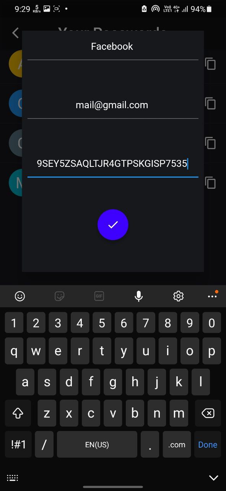

# Note: My main system is broken down, I will be uploading code as soon as it gets fixed. 
# Locker 
## A password Manger and Generator App
### Screenshots from the app
<table style="width:100%">
 <th>

  </th>
 <th>

  </th>

 <th>

 </th>
 <th>

  </th>
  <th>

  </th>
  <th>

  </th>
</table>

## 💡 Motivation
As our lives are getting more socially connected, we keep on adding new accounts on new websites and it results in a large cluster of passwords, ids, and websites it became extreme pain to manage all the passwords and ids, Well no more Locker app is here for your rescue it is a secure, reliable, and completely offline passwords manager and generator app. The Locker app aims to assist people in managing their passwords so that they can live a stress-free life.

## 👨‍💻 Features of the App
• User <b>Biometrics</b> (face & fingerprints) Authentication.   
• Generate Strong passwords.  
• Store all the password in secure <b>HIVE database</b>.  
• Supports all the <b>CRUD Operations</b>.  
• Works offline.  
• Securely copy password with a single click without revealing it.

## ⚙️ Tools and Technologies Used

## 🔽 Download the App from here
<a href="https://drive.google.com/drive/folders/1cznjNiquMvrQdk0zd8_uTU79JxKTO1WL?usp=sharing">Click Here</a>

